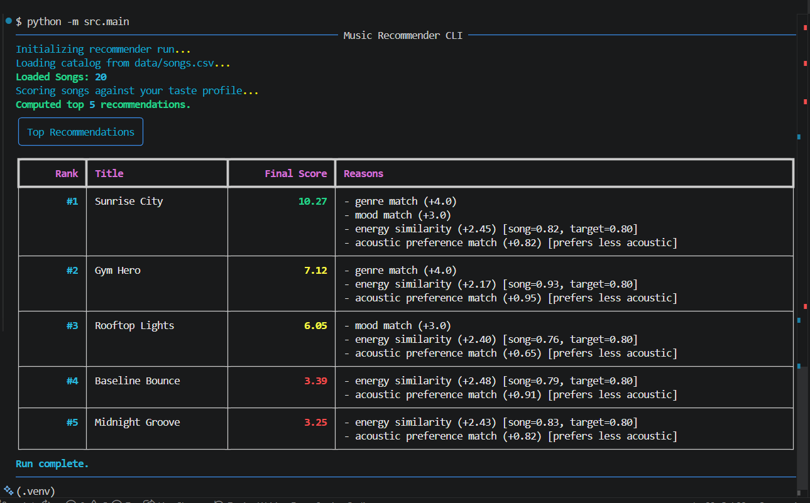
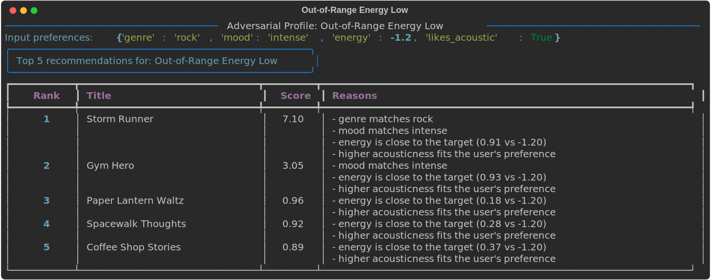
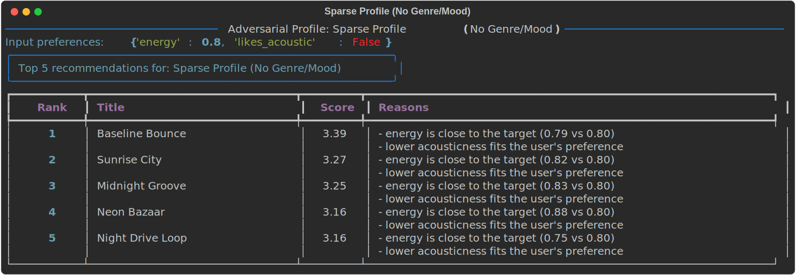

# 🎵 Music Recommender Simulation

## Project Summary

In this project you will build and explain a small music recommender system.

Your goal is to:

- Represent songs and a user "taste profile" as data
- Design a scoring rule that turns that data into recommendations
- Evaluate what your system gets right and wrong
- Reflect on how this mirrors real world AI recommenders

Replace this paragraph with your own summary of what your version does.

---

## How The System Works

Explain your design in plain language.

Some prompts to answer:

- What features does each `Song` use in your system
  - For example: genre, mood, energy, tempo
- What information does your `UserProfile` store
- How does your `Recommender` compute a score for each song
- How do you choose which songs to recommend

You can include a simple diagram or bullet list if helpful.

*Joshua P. Response:*
Real-world recommendation systems often combine collaborative signals, content metadata, and user context. This classroom simulation focuses on content-based personalization by matching a user's taste profile to song attributes in a small catalog.

For this specific implementation, these are the core features:

- `Song` features: `genre`, `mood`, `energy`, `tempo_bpm`, `valence`, `danceability`, `acousticness`
- `UserProfile` features: `favorite_genre`, `favorite_mood`, `target_energy`, `likes_acoustic`

### Plan

1. Build a taste profile with both categorical preferences (genre, mood) and numeric preferences (target energy, acoustic preference).
2. Score each song independently using a weighted rule.
3. Keep an explanation of why each song scored the way it did.
4. Sort all songs by total score in descending order.
5. Return the top `k` songs as recommendations.

### Finalized Algorithmic Recipe

For each song, compute:

- `+4.0` points if `song.genre == user.favorite_genre`
- `+3.0` points if `song.mood == user.favorite_mood`
- `+2.5 * (1 - abs(song.energy - user.target_energy))`
- `+1.0 * (1 - abs(song.acousticness - preferred_acousticness))`

Where `preferred_acousticness = 1.0` if `likes_acoustic=True`, otherwise `0.0`.

This creates a clear priority order: genre match first, mood match second, and numeric closeness as tie-breakers.

Here is the taste profile dictionary the recommender uses for comparisons:

```python
taste_profile = {
  "genre": "pop",
  "mood": "happy",
  "energy": 0.8,
  "likes_acoustic": False,
}
```

### Potential Biases To Expect

- Catalog bias: the dataset is small, so underrepresented genres and moods are less likely to appear in top results.
- Preference lock-in: strong genre and mood weights can repeatedly surface similar songs and reduce variety.
- Feature bias: songs are judged by a limited set of metadata features, not lyrics, culture, language, or evolving context.

This flowchart shows how one song moves through the recommender:

```mermaid
flowchart TD
  A[Input: User Prefs\n(taste profile)] --> B[Load songs.csv]
  B --> C[Read next song row]
  C --> D[Create a Song record]
  D --> E[Score one song\nCompare genre, mood, and numeric features]
  E --> F[Add scored song\nto candidate list]
  F --> G{More songs left?}
  G -- Yes --> C
  G -- No --> H[Sort candidate list\nfrom highest score to lowest]
  H --> I[Output: Top K Recommendations]
```

The important idea is that the recommender evaluates one song at a time, saves each scored song in a list, and only ranks the list after the full CSV has been processed.

Additional visualization:


---

## Getting Started

### Setup

1. Create a virtual environment (optional but recommended):

   ```bash
   python -m venv .venv
   source .venv/bin/activate      # Mac or Linux
   .venv\Scripts\activate         # Windows

2. Install dependencies

```bash
pip install -r requirements.txt
```

3. Run the app:

```bash
python -m src.main
```

### Running Tests

Run the starter tests with:

```bash
pytest
```

You can add more tests in `tests/test_recommender.py`.

---

## Experiments You Tried

I ran adversarial and edge-case user profiles to test whether the scoring logic could be tricked or produce unexpected results.

### 1) Case-Sensitivity Attack
Input: genre=Pop, mood=HAPPY, energy=0.90, likes_acoustic=False

Top 5:
- Storm Runner (3.38)
- Gym Hero (3.38)
- Neon Bazaar (3.31)
- Thunder Forge (3.29)
- Midnight Groove (3.14)


### 2) Out-of-Range Energy High
Input: genre=pop, mood=happy, energy=2.50, likes_acoustic=False

Top 5:
- Sunrise City (7.82)
- Gym Hero (4.95)
- Rooftop Lights (3.65)
- Thunder Forge (0.97)
- Baseline Bounce (0.91)


### 3) Out-of-Range Energy Low
Input: genre=rock, mood=intense, energy=-1.20, likes_acoustic=True

Top 5:
- Storm Runner (7.10)
- Gym Hero (3.05)
- Paper Lantern Waltz (0.96)
- Spacewalk Thoughts (0.92)
- Coffee Shop Stories (0.89)



### 4) Unknown Labels + Numeric Only
Input: genre=nonexistent-genre, mood=nonexistent-mood, energy=0.55, likes_acoustic=True

Top 5:
- Sunset Caravan (2.95)
- Coffee Shop Stories (2.94)
- Focus Flow (2.91)
- Velvet Rain (2.90)
- Midnight Coding (2.88)


### 5) Sparse Profile (No Genre/Mood)
Input: energy=0.80, likes_acoustic=False

Top 5:
- Baseline Bounce (3.39)
- Sunrise City (3.27)
- Midnight Groove (3.25)
- Neon Bazaar (3.16)
- Night Drive Loop (3.16)



Key behavior observed:
- Category matching is case-sensitive, so capitalized inputs can bypass genre/mood match boosts.
- Out-of-range numeric preferences still run and can flatten numeric scoring.
- Unknown or missing genre/mood values cause the model to rely mostly on energy and acousticness.

---

## Limitations and Risks

Summarize some limitations of your recommender.

Examples:

- It only works on a tiny catalog
- It does not understand lyrics or language
- It might over favor one genre or mood

You will go deeper on this in your model card.

---

## Reflection

Read and complete `model_card.md`:

[**Model Card**](model_card.md)

Write 1 to 2 paragraphs here about what you learned:

- about how recommenders turn data into predictions
- about where bias or unfairness could show up in systems like this


---

## 7. `model_card_template.md`

Combines reflection and model card framing from the Module 3 guidance. :contentReference[oaicite:2]{index=2}  

```markdown
# 🎧 Model Card - Music Recommender Simulation

## 1. Model Name

Give your recommender a name, for example:

> VibeFinder 1.0

---

## 2. Intended Use

- What is this system trying to do
- Who is it for

Example:

> This model suggests 3 to 5 songs from a small catalog based on a user's preferred genre, mood, and energy level. It is for classroom exploration only, not for real users.

---

## 3. How It Works (Short Explanation)

Describe your scoring logic in plain language.

- What features of each song does it consider
- What information about the user does it use
- How does it turn those into a number

Try to avoid code in this section, treat it like an explanation to a non programmer.

---

## 4. Data

Describe your dataset.

- How many songs are in `data/songs.csv`
- Did you add or remove any songs
- What kinds of genres or moods are represented
- Whose taste does this data mostly reflect

---

## 5. Strengths

Where does your recommender work well

You can think about:
- Situations where the top results "felt right"
- Particular user profiles it served well
- Simplicity or transparency benefits

---

## 6. Limitations and Bias

Where does your recommender struggle

Some prompts:
- Does it ignore some genres or moods
- Does it treat all users as if they have the same taste shape
- Is it biased toward high energy or one genre by default
- How could this be unfair if used in a real product

---

## 7. Evaluation

How did you check your system

Examples:
- You tried multiple user profiles and wrote down whether the results matched your expectations
- You compared your simulation to what a real app like Spotify or YouTube tends to recommend
- You wrote tests for your scoring logic

You do not need a numeric metric, but if you used one, explain what it measures.

---

## 8. Future Work

If you had more time, how would you improve this recommender

Examples:

- Add support for multiple users and "group vibe" recommendations
- Balance diversity of songs instead of always picking the closest match
- Use more features, like tempo ranges or lyric themes

---

## 9. Personal Reflection

A few sentences about what you learned:

- What surprised you about how your system behaved
- How did building this change how you think about real music recommenders
- Where do you think human judgment still matters, even if the model seems "smart"

